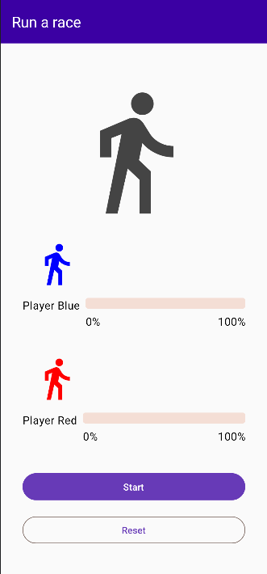

# Tracking Race App (Kotlin Coroutines)

This project is a tracking race app built using Kotlin and Coroutines.

## Features:

    Track runners' progress in a race.
    Visualize progress with progress bars.
    Include buttons to start and reset the race.

## Getting Started

    Clone this repository.
    Ensure you have the necessary dependencies installed for Kotlin and Coroutines.
    Open the project in your preferred IDE (Android Studio recommended).
    Run the app!

## Image

This screenshot shows the main screen of the tracking race app. Runners are displayed with progress bars, and there are buttons to start and reset the race.

Feel free to customize and extend this app further!
